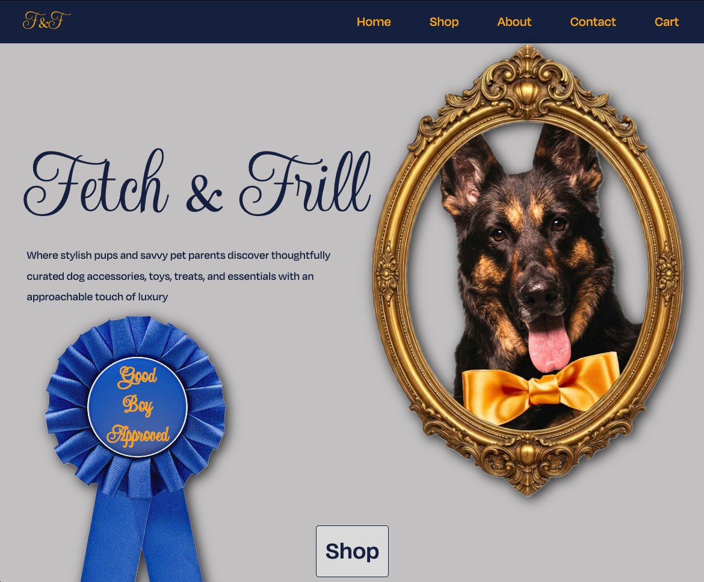

# 🐾 Fetch & Frill

## Overview

Fetch & Frill is a fictional online boutique specializing in stylish, modern, and thoughtfully curated dog accessories. The company was founded in Austin, Texas in 2016 by dog lover Aaron Wilbur and a group of friends who shared a passion for helping pets look their best through fashionable and accessible luxury products.

The Fetch & Frill site has been re-imagined as a fully functioning storefront built as a Single Page Application (SPA) using React and Vite. The site showcases modern front-end development practices, reusable React components, dynamic content rendering, responsive layouts, and shopping cart functionality.



### Visit the [live site](https://priscawhite.github.io/fetchandfrill/)

---

## Features

### Storefront

* Responsive homepage
* Featured products section
* Product catalog
* Product categories
* Product cards with images and pricing
* Dynamic product rendering

### Shopping Experience

* Add products to cart
* Update cart quantities
* Remove items from cart
* Shopping cart summary
* Cart state persistence using Local Storage

### Company Information

* Company mission statement
* About Us section
* Team member profiles
* Contact information

### User Interface

* Modern boutique-inspired design
* Mobile-first responsive layout
* Custom color palette
* Custom typography
* Reusable React components
* Flexbox and CSS Grid layouts

---

## Tech Stack

### Front-End

* React
* JavaScript (ES6+)
* HTML5
* CSS3

### Build Tools

* Vite
* npm

### Deployment

* GitHub Pages
* gh-pages

### Version Control

* Git
* GitHub

---

## Project Structure

```text
📁 fetch-and-frill/
│
├── 📁 public/
│ 
├── 📁 src/
│   ├── 📁 assets/
│   │   ├── Fonts/
│   │   └── Images/
│   │
│   ├── 📁 components/
│   │   ├── Header/
│   │   ├── Navbar/
│   │   ├── Footer/
│   │   ├── Layout/
│   │   ├── ProductList/
│   │   ├── ProductGrid/
│   │   ├── ProductModal/
│   │   ├── Cart/
│   │   ├── CheckoutModal/
│   │   └── ScrollFadeIn/
│   │
│   ├── 📁 pages/
│   │   ├── Home/
│   │   ├── Shop/
│   │   ├── About/
│   │   ├── Contact/
│   │   └── Cart/
│   │
│   ├── 📁 data/
│   │   ├── featured-products.js
│   │   └── products.js
│   │
│   ├── App.jsx
│   └── main.jsx
│
├── package.json
├── vite.config.js
└── README.md
```

---

## Installation

Clone the repository:

```bash
git clone https://github.com/priscawhite/fetchandfrill.git
```

Navigate into the project directory:

```bash
cd fetchandfrill
```

Install dependencies:

```bash
npm install
```

Start the development server:

```bash
npm run dev
```

---

## Production Build

Create an optimized production build:

```bash
npm run build
```

Preview the production build locally:

```bash
npm run preview
```

The build output will be generated in the `dist` folder.

---

## GitHub Pages Deployment

### Install gh-pages

```bash
npm install --save-dev gh-pages
```

### Configure Vite

In `vite.config.js`:

```javascript
import { defineConfig } from 'vite'
import react from '@vitejs/plugin-react'

export default defineConfig({
  plugins: [react()],
  base: '/fetchandfrill/'
})
```

### Add Deployment Scripts

In `package.json`:

```json
{
  "scripts": {
    "dev": "vite",
    "build": "vite build",
    "preview": "vite preview",
    "predeploy": "npm run build",
    "deploy": "gh-pages -d dist"
  }
}
```

### Deploy

```bash
npm run deploy
```

Configure GitHub Pages to deploy from:

```text
Branch: gh-pages
Folder: /(root)
```

---

## Future Enhancements

* Product search
* Category filtering
* Wishlist functionality
* Customer reviews
* User authentication
* Stripe payment integration
* Order history
* Admin dashboard
* Product management system
* Analytics and SEO optimization

---

## Learning Objectives

This project demonstrates proficiency in:

* React fundamentals
* Component-based architecture
* State management
* Responsive web design
* Single Page Applications (SPA)
* Vite build tooling
* GitHub Pages deployment
* Modern JavaScript development practices

---

## Acknowledgments

Special thanks to:  
* GitHub Pages for free hosting
* Open web technologies (HTML, CSS, JavaScript)
* Inspiration from modern pet lifestyle brands and UI design systems

---

## Author

**Prisca W.**

Cloud Engineer • AI Enthusiast • Aspiring Full-Stack Developer

*From code to cloud--powering modern applications with serverless precision*

---

## License

Developed as part of a Full-Stack Development learning journey focused on modern web development, cloud technologies, and creating portfolio-ready applications.  

This project is intended for educational and portfolio purposes.
